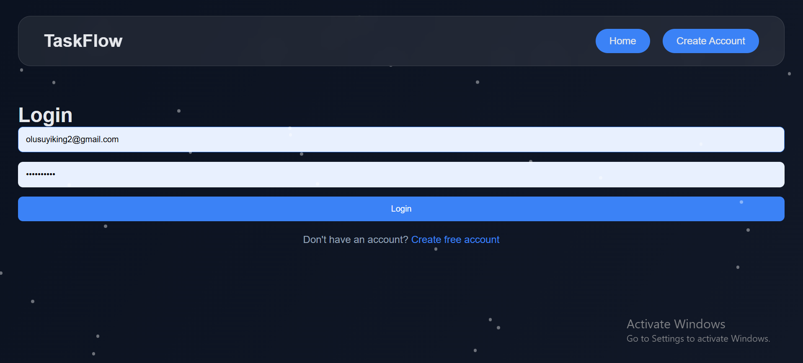
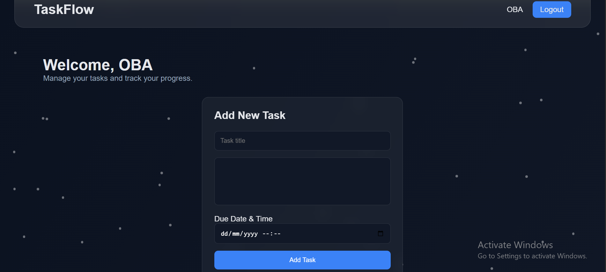

# TaskFlow 🚀

TaskFlow is a full-stack task management web application built with **Flask**.  
It helps users organize, track, and manage their tasks with authentication, deadlines, and status tracking.

## Features ✨

- User registration and login
- Secure password hashing
- Session-based authentication
- Create, read, update, and delete (CRUD) tasks
- Task status management
- Task filtering (Pending / Completed)
- Due date and time support
- Automatic overdue task detection
- Responsive user interface
- Animated particle background
- Deployed production application

---

## Tech Stack 🛠️

### Backend
- Python
- Flask
- SQLite

### Frontend
- HTML
- CSS
- JavaScript
- Jinja2 Templates

### Deployment
- Render

---

## Screenshots 📸

### Landing Page


---

### Login Page



---

### Dashboard



---


## Project Structure
TaskFlow/
│
├── app.py
├── migration.py
├── requirements.txt
├── README.md
│
├── static/
│ ├── css/
│ ├── js/
│ └── images/
│
├── templates/
│
└── screenshots/
├── landing-page.png
├── login.png
├── dashboard.png
└── mobile-view.png


---

## Running Locally

Clone the repository:

```bash
git clone https://github.com/olusuyiking2-sketch/TaskFlow.git

Navigate into the project:

cd TaskFlow

Create a virtual environment:

python -m venv venv

Activate it:

Windows:

venv\Scripts\activate

Install dependencies:

pip install -r requirements.txt

Run the application:

python app.py
Future Improvements 🚀
Task reminders and push notifications
Task priority levels
Email notifications
Advanced analytics dashboard
API integration
Author

Built by King Olusuyi


After saving:

```bash
git add README.md
git commit -m "Update README with project documentation and screenshots"
git push
